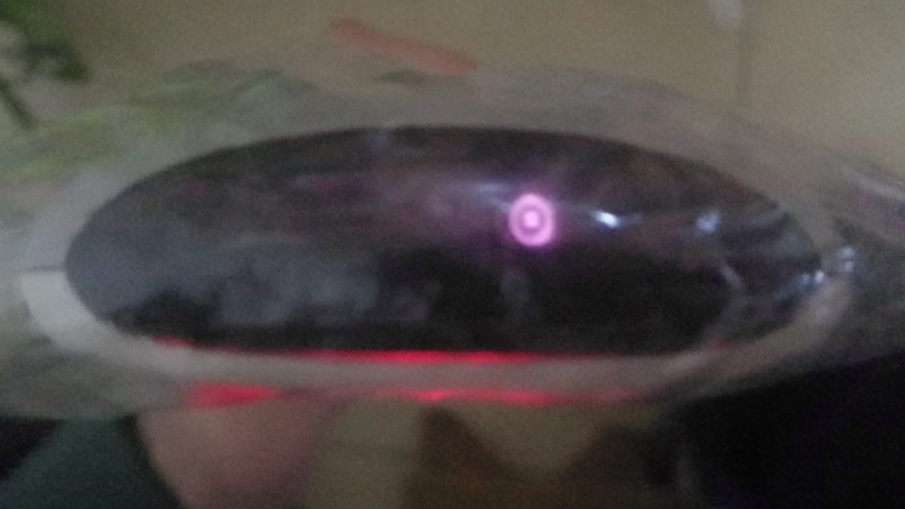

实验一 用手机摄像头观察红外遥控器
===============================================================

这个思路真的挺新颖的。一年前我上过一门光学仪器的选修课，其中专门讲到了光探测器，提到了半导体探测器具有长波限 :math:`\lambda_c`。这个长波限是由半导体的能带结构决定的。具体说来，它和带隙 :math:`E_g` 的关系为

.. math:: \lambda_c = \frac{hc}{E_g}. 

容易想见，能量小于带隙的电子无法被半导体有效吸收，因此存在长波限。对于硅晶体来说，其带隙 :math:`1.12\,\mathrm{eV}`，折算成波长刚好落在红外区。不过，需要指出的是，这种泄露是很有限的。

实验装置
---------------------

- 华为荣耀V9
- 苹果iPhone 7
- 歌华有线机顶盒遥控器

实验结果
---------------

华为荣耀V9

红色的圆点清晰可见。

苹果iPhone 7

无法观察到红点。

