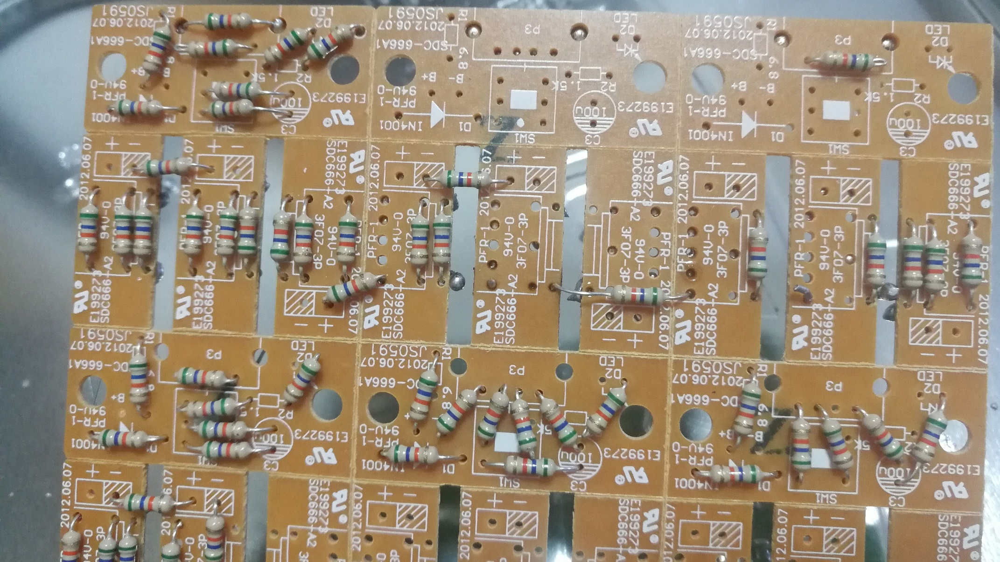
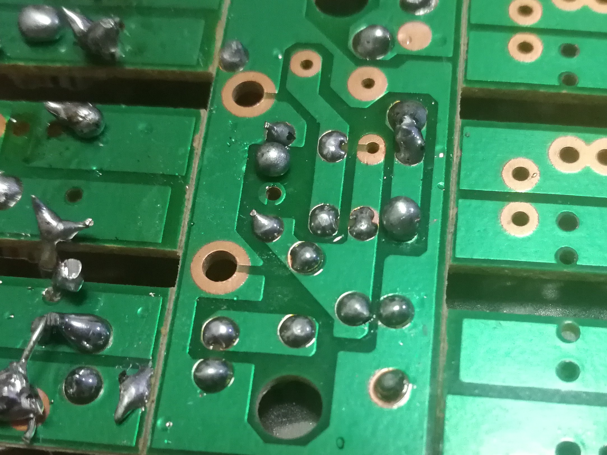

实验三 焊接练习
===============================

坦白来说，在初中二年级，我在通用技术课上就学过焊接，焊过颜色随电压变化而变化的呼吸灯，也焊过放在兔子模型里的双闪灯。除去焊错一个电解电容之外，就一帆风顺做下来了。这经历我今日的焊接带来了一好一坏两个影响：好的影响是在焊或插任何极性原件前都会仔细检查引脚，因为那时好像没有镊子，要在烙铁把焊锡熔化的瞬间把电容拔出来，不慎烫了手；坏的影响是它给我留下了焊接是一件简单事的印象，让我没能留意到很多细节。

焊接过程
----------------------

书桌上书多，焊笔又烫，我担心把书点着了，所以拿椅子当工作台，坐在板凳上焊。值得一提的是，图片中的板凳在我做到第八个实验的时候塌了，可能是真的胖了。

.. image:: camera/soldering.jpg
    :width: 640px 
    :alt: 我在焊接

焊接成品
----------------

正面 

背面

焊接心得
------------------

下面的这些心得有些是从网络上学到的技巧，有些是实践的总结，姑且不加区分地罗列在下面。

1. 电路板有正反，应该从\ **没有**\ 印电路原件的那一侧上锡，否则很难让锡粘到板子上。

#. 勤上锡。不用烙铁时就要往头上放一些，氧化了的黑色烙铁头真的不沾锡。焊锡是很便宜的。

#. 最初练习时，可以先不插元件，直接往焊点上锡，训练好节奏练有元件的。

#. 烙铁头可以调整长度控制温度。最初开始练习时，可以适当地伸长烙铁头，降低温度，这样焊接过程温度较低，焊接过程更从容。但熟练后还是温度高舒服，因为一方面这样效率高，另一方面不容易烫坏原件。

#. 海绵要上水。硬硬的海绵不能直接用，干海绵会被工作中的烙铁会烫坏。此外，上了水还要攥干。这是因为海绵的目的是清理烙铁头，而太湿的海绵造成烙铁头温度迅速下降，从而使焊锡挂在烙铁头上，无法起到清理效果。

#. 应该在有金属圈的焊点上练习焊接，那样焊点更容易沾锡。

#. 插入元件后，将元件引脚弯曲后再焊接可以起到固定元件的效果。

#. 松香不要上多了，过多的松香可能会造成焊锡难以粘到板子上。

#. 海绵要放在桌子上用，不要一手端着海绵，另一只手拿焊笔在上面蹭，那样滚烫焊锡可能\ **溅到手上**\ 。

