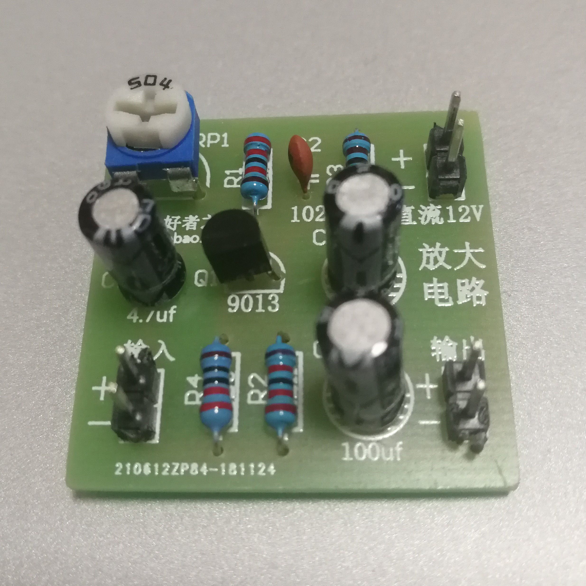
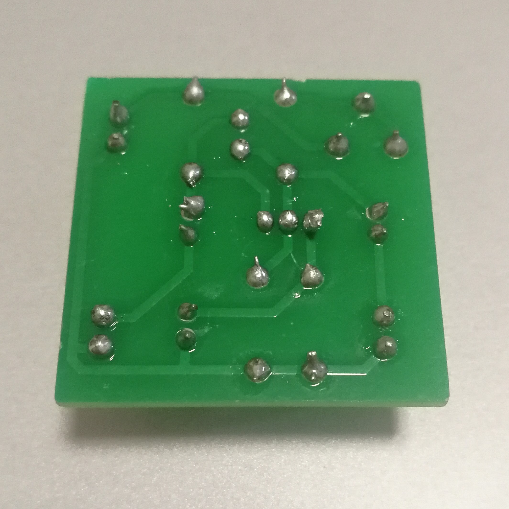

实验四 焊接晶体管放大器电路
==================================

焊接成品
------------------------

正面

背面

直流静态工作点的确定
--------------------------------------

这个我还没来得及做，以后再说。

注意事项
-----------------------

我一开始还真不知道它是什么，也不知道它应该长头插板里还是短头。这主要是因为提供的实物图是个俯视图，看不出垂直方向的长短。

.. image:: camera/pins.jpg
    :width: 480px
    :alt: 电源插针

直到老师告诉我它的名字叫“电源插针”，然后我一搜索：

.. image:: https://iknow-pic.cdn.bcebos.com/b58f8c5494eef01f4cc73285e0fe9925bd317d9a
    :width: 480px 
    :alt: 主板插针

其实吧，它还是蛮常见的。
